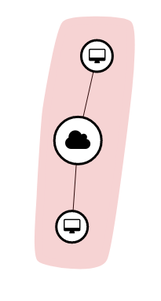

# One Network Multiple Subnets

*Or, a long winded answer as to why you should follow the one-subnet-per-network
convention.*

Instances on different subnets within the same network can always communicate,
even if there is no router attached to their default gateways:

```bash
cat <<EOF > cloud-config.yml
#cloud-config

# mkpasswd -m sha-512 password saltpepper
password: $6$saltpepper$mZ70s.b21Yp8gpQqslZBnEQE4jSs/niYZYvEaFftCXQKnpY4cgolCeKr0Otz0bFr.1C09zqNozjzUieGC.ArX0
EOF

openstack network create test
openstack subnet create --subnet-range 10.10.0.0/24 --network test test-10
openstack subnet create --subnet-range 10.20.0.0/24 --network test test-20

openstack server create \                                                                                                                                                          [ HSC_CanDIG] ~/git-candig-kidnet/project
--image ubuntu_1604_20180703_base \
--flavor tiny \
--nic net-id=$(openstack network show test -c id -f value),v4-fixed-ip=10.10.0.5 \
--security-group debug_all \
--user-data cloud-config.yml \
test-10

openstack server create \                                                                                                                                                          [ HSC_CanDIG] ~/git-candig-kidnet/project
--image ubuntu_1604_20180703_base \
--flavor tiny \
--nic net-id=$(openstack network show test -c id -f value),v4-fixed-ip=10.20.0.5 \
--security-group debug_all \
--user-data cloud-config.yml \
test-20

# from inside 10.10.0.5, ping 10.20.0.5
# from inside 10.20.0.5, ping 10.10.0.5
```

It looks like:



**This makes subnets unsuitable for network isolation.** At this point, they are
simply a means to put certain VMs into specific IPs for organizational means
(for example, maybe a subnet with no DHCP for a [static etcd cluster](https://github.com/coreos/etcd/blob/79d27328e3b2b38b3adf191753b5f0dd75b174d1/Documentation/op-guide/clustering.md#static)).
Furthermore, **there is no option from Horizon to launch a VM into a specific
subnet**. Instead, you must either use

```
--nic net-id=$(openstack network show test -c id -f value),v4-fixed-ip=10.10.0.5 \
```

to place the VM into a specific subnet (via the fixed IP). Or, if you do not
want a fixed IP (i.e. you want to get an IP via DHCP), then you must

1. Create a port on the specific subnet: `openstack port create --network test --fixed-ip subnet=test-20 myport`
2. Launch the VM with `--nic port-id=$(openstack port show myport -f value -c id)`
3. Manage the lifecycle of that port separate from VMs (i.e. delete it manually after deleting the VM)

One use case could be to declare a group of fixed IPs ahead of time, and manage
their lifecycle separate from VMs. This could be useful for a Swarm cluster for
example, where you would want the IPs of the master nodes to stay constant. By
isolating the lifecycle of that specific IP (port) from the VMs, you could bring
up new machines to replace masters (assuming you also stored relevant state in a
volume). However this would work just as well by simply setting fixed IPs on the
instances, without manually creating ports. This is is similar to the Infrakit
setup described in [InfraKit and Docker Swarm: A Fault-Tolerant and Self-Healing
Cluster](https://dzone.com/articles/infrakit-and-docker-swarm-mode-a-fault-tolerant-and-self-healing-cluster).

Of course, you could still choose fixed IPs even with a single subnet within the
tenant. So the extra subnet is purely for organizational means.

Quite lots of effort for minimal gain. **So then what is the use case for multiple
subnets in a network? Apparently the practical use case is dual stack IPv4 +
IPv6.**

See:

- [Can we have multiple subnets on a neutron network?](https://ask.openstack.org/en/question/95029/can-we-have-multiple-subnets-on-a-neutron-network/)
- [Use case for multiple subnets on a single neutron network](https://ask.openstack.org/en/question/4072/use-case-for-multiple-subnets-on-a-single-neutron-network/)
